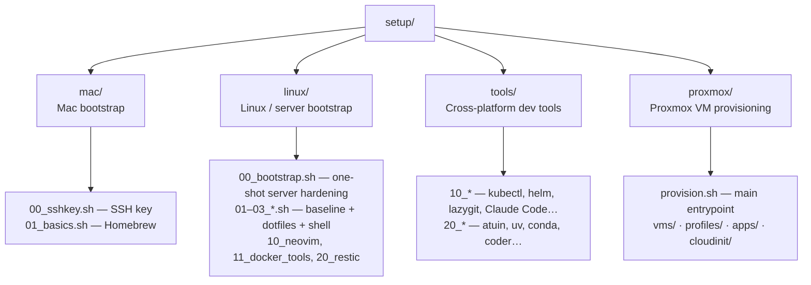

# setup

Personal machine setup scripts for macOS, Linux servers, and Proxmox VMs.
Scripts are organised by platform and numbered by phase so you always know
what to run and in what order.

---

## Repo Structure



---

## Quick Start

### First: set up `.env`

```bash
cp .env.example .env
# fill in SETUP_USER, SETUP_HOST, DOTFILES_REPO, GH_TOKEN
```

`.env` is sourced automatically by all scripts — no hardcoded usernames or tokens.

---

### New Linux Server — automated (recommended)

Run from your **local machine** — handles user creation, key upload, and SSH hardening in one step:

```bash
bash linux/00_bootstrap.sh <HOST_IP>
bash linux/00_bootstrap.sh <HOST_IP> --root-pass 'password'
```

Then SSH in as your user and continue:

```bash
bash linux/01_basics.sh
bash linux/02_dotfiles.sh
bash linux/03_shell.sh
exec zsh && p10k configure
```

---

### New Linux Server — manual (step by step)

Run as **root** on the fresh server:

```bash
bash linux/00_adduser.sh      # create user (SETUP_USER) + add to sudo & docker groups
bash linux/00_sudoers.sh      # passwordless sudo for user
```

From your **local machine** — copy your SSH key over while password auth is still on:

```bash
bash mac/00_sshkey.sh user@<host>
```

Back on the server as **root** — lock down SSH once the key is confirmed working:

```bash
bash linux/00_sshd.sh         # key-only auth, no root login, restart sshd
```

Then SSH in as your user and continue with Phase 1:

```bash
bash linux/01_basics.sh
bash linux/02_dotfiles.sh
bash linux/03_shell.sh
exec zsh && p10k configure
```

---

### Linux Dev Machine (existing server / VM)

```bash
bash linux/01_basics.sh       # baseline apt packages
bash linux/02_dotfiles.sh     # chezmoi dotfiles + tmux plugins
bash linux/03_shell.sh        # oh-my-zsh + powerlevel10k + plugins
exec zsh && p10k configure
```

---

### macOS

```bash
bash mac/01_basics.sh         # Homebrew + baseline packages
bash linux/02_dotfiles.sh     # chezmoi dotfiles + tmux plugins
bash linux/03_shell.sh        # oh-my-zsh + powerlevel10k + plugins
exec zsh && p10k configure
```

---

### Proxmox VM Provisioning

Provision a VM from any machine (Mac, Linux, MobaXterm):

```bash
cp proxmox/.env.example proxmox/.env   # fill in once
./proxmox/provision.sh --dry-run proxmox/vms/ragflow.yaml
./proxmox/provision.sh proxmox/vms/ragflow.yaml
```

See **[proxmox/README.md](proxmox/README.md)** for full documentation, including
Mermaid diagrams of the provisioning flow, VM model, and bootstrap sequence.

---

## Script Reference

| Script | What it does | Linux | macOS |
|--------|-------------|:-----:|:-----:|
| **mac/ — Mac bootstrap** | | | |
| `mac/00_sshkey.sh` | Generate ED25519 key pair + copy to server | — | ✓ |
| `mac/01_basics.sh` | Homebrew + baseline packages | — | ✓ |
| `mac/mx-keys-fix.sh` | Logitech MX Keys Fn-key fix (macOS) | — | ✓ |
| `mac/quickemu_install.sh` | quickemu + quickget — run lightweight VMs | — | ✓ |
| `mac/quickgui_install.sh` | quickgui — GUI front-end for quickemu | — | ✓ |
| **linux/ — Server bootstrap** | | | |
| `linux/00_bootstrap.sh` | One-shot: create user, upload key, harden SSH | ✓ | — |
| `linux/00_adduser.sh` | Create user (`SETUP_USER`), sudo + docker groups | ✓ | — |
| `linux/00_sudoers.sh` | Passwordless sudo for user | ✓ | — |
| `linux/00_sshd.sh` | Key-only auth, disable password + root login | ✓ | — |
| `linux/01_basics.sh` | apt baseline: git, zsh, eza, ripgrep, fd, node… | ✓ | — |
| `linux/02_dotfiles.sh` | chezmoi dotfiles (`DOTFILES_REPO`) + tpm | ✓ | ✓ |
| `linux/03_shell.sh` | oh-my-zsh, powerlevel10k, autosuggestions, syntax-hl | ✓ | ✓ |
| `linux/10_neovim.sh` | Neovim AppImage → `~/.local/bin/nvim` | ✓ | — |
| `linux/11_docker_tools.sh` | ctop, dive, lazydocker | ✓ | — |
| `linux/20_restic.sh` | restic — fast, encrypted backups | ✓ | — |
| **tools/ — Cross-platform dev tools** | | | |
| `tools/10_lazygit.sh` | lazygit (latest GitHub release) | ✓ | ✓ |
| `tools/10_kubectl.sh` | kubectl (latest stable) | ✓ | ✓ |
| `tools/10_helm.sh` | Helm 3 (official installer) | ✓ | ✓ |
| `tools/10_k3d.sh` | k3d — k3s in Docker | ✓ | ✓ |
| `tools/10_claude.sh` | Claude Code CLI (native installer) | ✓ | ✓ |
| `tools/10_ai_tools.sh` | Gemini CLI, GH Copilot CLI, Pi | ✓ | ✓ |
| `tools/10_llm_tools.sh` | llm, files-to-prompt, ttok, strip-tags, aider | ✓ | ✓ |
| `tools/20_atuin.sh` | atuin shell history (replaces mcfly) | ✓ | ✓ |
| `tools/20_uv.sh` | uv — fast Python package + project manager | ✓ | ✓ |
| `tools/20_conda.sh` | Miniconda (default) or Anaconda | ✓ | ✓ |
| `tools/20_kind.sh` | kind — Kubernetes IN Docker (latest) | ✓ | ✓ |
| `tools/20_minikube.sh` | minikube — local Kubernetes cluster | ✓ | ✓ |
| `tools/20_coder.sh` | Coder — self-hosted dev environments | ✓ | ✓ |
| `tools/20_teleport.sh` | Teleport v17 — zero-trust access | ✓ | ✓ |
| `tools/20_fonts.sh` | Nerd Fonts: JetBrainsMono + Meslo | ✓ | ✓ |
| `tools/yabs.sh` | Server benchmark (Yet Another Bench Script) | ✓ | — |

---

## mac/ — Mac Bootstrap

### `mac/00_sshkey.sh` — SSH key setup

Generates an ED25519 key pair (if one doesn't already exist at the given path)
and copies the public key to a remote server using `ssh-copy-id`. Run this
**before** `linux/00_sshd.sh` locks out password auth.

```bash
bash mac/00_sshkey.sh                                    # uses SETUP_HOST from .env or prompts
bash mac/00_sshkey.sh user@1.2.3.4                       # specify host
bash mac/00_sshkey.sh user@1.2.3.4 ~/.ssh/id_myserver    # custom key path
```

Default key path: `~/.ssh/id_ed25519`

---

### `mac/01_basics.sh` — Baseline packages (macOS)

Installs Homebrew if not present, then installs an equivalent set of tools.

```bash
bash mac/01_basics.sh
```

| Group | Tools |
|-------|-------|
| Core | `git` `gh` `vim` `wget` |
| Shell | `zsh` `tmux` `fzf` `zoxide` |
| Files | `eza` `bat` `fd` `ripgrep` `lazygit` |
| Monitor | `btop` `ncdu` `hyperfine` `mactop` `viddy` |
| Data | `jq` `yq` `glow` `lnav` `csvlens` `jless` `tldr` |
| Dev workflow | `git-delta` `direnv` `watchexec` |
| Network | `httpie` `rsync` |
| AI / LLM | `models` `llmfit` |
| Terminal extras | `taproom` `timg` |
| Runtime | Node.js LTS (via nvm) |

> **Note:** Docker Desktop must be installed manually from docker.com.

---

## linux/ — Server Bootstrap

### `linux/00_bootstrap.sh` — One-shot server hardening *(run locally)*

The recommended starting point for any fresh host. Runs from your **local
machine**, SSHes in as root, and performs all hardening steps non-interactively.

```bash
bash linux/00_bootstrap.sh 192.168.1.50
bash linux/00_bootstrap.sh 192.168.1.50 --root-pass 'password'
```

Steps performed:
1. Create user (`SETUP_USER` from `.env`) with sudo + docker groups
2. Add passwordless sudo via `/etc/sudoers.d/`
3. Upload `SSH_PUBLIC_KEY` from `.env` to `~/.ssh/authorized_keys`
4. Harden sshd: key-only auth, no root login, no passwords
5. Report: `Host secured. Connect with: ssh <user>@<host>`

Reads credentials from `proxmox/.env` → `.env` → `linux/.env` (first found wins).

---

### `linux/00_adduser.sh` — Create user *(run as root)*

Creates the user (`SETUP_USER` from `.env`) and adds them to the `sudo` and `docker` groups.

```bash
bash linux/00_adduser.sh
```

---

### `linux/00_sudoers.sh` — Passwordless sudo *(run as root)*

Writes `/etc/sudoers.d/<user>-nopasswd` granting `NOPASSWD: ALL` to the
specified user, then validates it with `visudo -c` before saving so a broken
sudoers file can never land.

```bash
sudo bash linux/00_sudoers.sh           # defaults to SETUP_USER
sudo bash linux/00_sudoers.sh alice     # explicit override
```

---

### `linux/00_sshd.sh` — Harden SSH *(run as root)*

Edits `/etc/ssh/sshd_config` to enforce key-based authentication and restarts
sshd. **Run this only after your SSH key is working** — it disables password
login, locking you out if the key isn't in place.

```bash
bash linux/00_sshd.sh
```

Changes applied:
- `PubkeyAuthentication yes`
- `PasswordAuthentication no`
- `PermitRootLogin no`
- `AuthorizedKeysFile .ssh/authorized_keys`

> `RSAAuthentication` is deprecated in OpenSSH 7.4+ and is no longer modified.

---

### `linux/01_basics.sh` — Baseline packages (Linux)

Adds the `universe` repo and installs a comprehensive set of apt packages.
Run this first on any Linux machine.

```bash
bash linux/01_basics.sh
```

| Group | Tools |
|-------|-------|
| Core | `git` `gh` `vim` `wget` `curl` `build-essential` |
| Shell | `zsh` `tmux` `fzf` `zoxide` |
| Files | `eza` `bat` `fd` `ripgrep` `ranger` |
| Monitor | `btop` `htop` `ncdu` `powertop` `hyperfine` |
| Data | `jq` `yq` `glow` `lnav` `csvlens` `ack` `tldr` |
| Dev workflow | `git-delta` `direnv` `watchexec` `python3` `docker-compose` |
| Network | `httpie` `rsync` `dnsutils` |
| AI / LLM | `models` |
| Runtime | Node.js LTS (via nvm) `libfuse2` |

> **Notes:**
> - `bat` is installed as `batcat` on Ubuntu — the script creates a `~/.local/bin/bat` symlink automatically.
> - `fd` is the `fd-find` apt package — the binary is `fd` after install.
> - nvm init is added to `~/.zshrc` by `02_dotfiles.sh` so it survives chezmoi applying dotfiles.

---

### `linux/02_dotfiles.sh` — Dotfiles + tmux plugins

Installs [chezmoi](https://chezmoi.io) to `~/.local/bin/chezmoi` and applies
the dotfiles repo (`DOTFILES_REPO` from `.env`). Also bootstraps
[tpm](https://github.com/tmux-plugins/tpm) (Tmux Plugin Manager) and appends
nvm init to `~/.zshrc` if not already present.

```bash
bash linux/02_dotfiles.sh
```

After running, open tmux and press `prefix+I` to install tmux plugins.

---

### `linux/03_shell.sh` — Shell setup (oh-my-zsh + powerlevel10k)

Idempotent — safe to re-run. Skips any component already installed.

```bash
bash linux/03_shell.sh
```

Installs:
- **oh-my-zsh** — with `RUNZSH=no KEEP_ZSHRC=yes` (won't overwrite your `.zshrc`)
- **powerlevel10k** — cloned into `~/.oh-my-zsh/custom/themes/`
- **zsh-autosuggestions** — fish-style inline completions
- **zsh-syntax-highlighting** — command highlighting as you type
- Sets zsh as default shell via `usermod` (falls back with instructions if sudo unavailable)

After running:

```bash
exec zsh           # reload shell
p10k configure     # optional — config already applied from dotfiles
```

Make sure your `.zshrc` contains:
```zsh
ZSH_THEME="powerlevel10k/powerlevel10k"
plugins=(git zsh-autosuggestions zsh-syntax-highlighting)
```

---

### `linux/10_neovim.sh` — Neovim

Downloads the latest Neovim AppImage and installs it to `~/.local/bin/nvim`.
`libfuse2` (required for AppImage) is already included in `linux/01_basics.sh`.

```bash
bash linux/10_neovim.sh
```

---

### `linux/11_docker_tools.sh` — Docker utilities

Installs three Docker companion tools. All versions resolved at runtime via
the GitHub API — no hardcoded versions.

```bash
bash linux/11_docker_tools.sh
```

| Tool | What it does |
|------|-------------|
| [ctop](https://github.com/bcicen/ctop) | `top`-like interface for containers |
| [dive](https://github.com/wagoodman/dive) | Explore image layers and wasted space |
| [lazydocker](https://github.com/jesseduffield/lazydocker) | TUI for Docker management |

---

### `linux/20_restic.sh` — restic

Installs [restic](https://restic.net) via apt, then runs `restic self-update`
to ensure the latest version regardless of what's in the apt repo.

```bash
bash linux/20_restic.sh
```

---

## tools/ — Cross-Platform Dev Tools

### `tools/10_lazygit.sh` — lazygit

Downloads the latest release from GitHub and installs to `/usr/local/bin`.

```bash
bash tools/10_lazygit.sh
```

---

### `tools/10_kubectl.sh` — kubectl

Downloads the latest stable kubectl binary from the official Kubernetes CDN.

```bash
bash tools/10_kubectl.sh
```

---

### `tools/10_helm.sh` — Helm 3

Runs the official Helm installer script.

```bash
bash tools/10_helm.sh
```

---

### `tools/10_k3d.sh` — k3d

Installs [k3d](https://k3d.io) (k3s in Docker) via the official installer script.

```bash
bash tools/10_k3d.sh
```

---

### `tools/10_claude.sh` — Claude Code

Installs [Claude Code](https://claude.ai/code) using the native installer.

```bash
bash tools/10_claude.sh
```

After installing, run `claude` to get started.

---

### `tools/10_ai_tools.sh` — AI coding assistants

Installs Gemini CLI, GitHub Copilot CLI, and Pi. Requires `nodejs` + `npm`
and `gh` (both included in the Phase 1 basics scripts).

```bash
bash tools/10_ai_tools.sh
```

| Tool | Command | Source |
|------|---------|--------|
| Gemini CLI | `gemini` | Google — `@google/gemini-cli` |
| GitHub Copilot CLI | `gh copilot` | `gh extension install github/gh-copilot` |
| Pi coding agent | `pi` | badlogic — `@mariozechner/pi-coding-agent` |

---

### `tools/10_llm_tools.sh` — LLM CLI utilities

Installs Simon Willison's LLM stack and aider via `uv tool install`.
Bootstraps `uv` automatically if not present.

```bash
bash tools/10_llm_tools.sh
```

| Tool | Command | What it does |
|------|---------|-------------|
| [llm](https://llm.datasette.io) | `llm` | Run prompts against any model; log history |
| [files-to-prompt](https://github.com/simonw/files-to-prompt) | `files-to-prompt` | Concat a codebase into a single prompt |
| [ttok](https://github.com/simonw/ttok) | `ttok` | Count tokens before making API calls |
| [strip-tags](https://github.com/simonw/strip-tags) | `strip-tags` | Strip HTML to clean text for LLM input |
| [aider](https://aider.chat) | `aider` | AI pair programmer, git-native |

> `llmfit` and `timg` are installed via brew in `mac/01_basics.sh`.

---

### `tools/20_atuin.sh` — atuin shell history

Installs [atuin](https://atuin.sh) — shell history with full-text search,
statistics, and optional cross-machine sync.

```bash
bash tools/20_atuin.sh
```

The script automatically:
- Adds `~/.atuin/bin` to `PATH` in `.zshrc` and `.bashrc`
- Adds `eval "$(atuin init zsh)"` to `.zshrc` (guarded so it's safe if atuin isn't present)

After installing:
```bash
atuin import auto          # migrate existing shell history
```

Optional sync across machines:
```bash
atuin register   # create account
atuin login      # on other machines
atuin sync
```

---

### `tools/20_uv.sh` — uv Python manager

Installs [uv](https://docs.astral.sh/uv/) by Astral — an extremely fast Python
package and project manager. Handles Python version management, virtual envs,
and package installation. Replaces pip/pyenv/conda for most workflows.

```bash
bash tools/20_uv.sh
```

Quick reference:
```bash
uv python install 3.12      # install a Python version
uv venv && source .venv/bin/activate
uv pip install <package>    # fast pip replacement
uv run script.py            # run with auto-managed deps
```

---

### `tools/20_conda.sh` — Conda (Miniconda / Anaconda)

Installs Miniconda (default, recommended) or full Anaconda. Prefer `tools/20_uv.sh`
for most Python workflows — use conda only when you need the conda ecosystem.

```bash
bash tools/20_conda.sh              # Miniconda (default)
bash tools/20_conda.sh miniconda    # explicit
bash tools/20_conda.sh anaconda     # full Anaconda suite (Anaconda3-2024.10-1)
```

After Miniconda:
```bash
~/miniconda/bin/conda init zsh
exec zsh
```

---

### `tools/20_kind.sh` — kind

Installs [kind](https://kind.sigs.k8s.io) (Kubernetes IN Docker). Version
resolved at runtime from the GitHub API.

```bash
bash tools/20_kind.sh
```

---

### `tools/20_minikube.sh` — minikube

Installs the latest [minikube](https://minikube.sigs.k8s.io) for running a
local Kubernetes cluster.

```bash
bash tools/20_minikube.sh
```

---

### `tools/20_coder.sh` — Coder

Installs [Coder](https://coder.com) for self-hosted cloud development
environments using the official installer.

```bash
bash tools/20_coder.sh
```

After installing: `coder server` to start, then open `http://localhost:3000`.

---

### `tools/20_teleport.sh` — Teleport

Installs [Teleport](https://goteleport.com) using the official installer.
Defaults to v17; pass a version argument to override.

```bash
bash tools/20_teleport.sh        # installs v17
bash tools/20_teleport.sh 16     # specific major version
```

---

### `tools/20_fonts.sh` — Nerd Fonts

Downloads and installs **JetBrainsMono** and **Meslo** Nerd Fonts to
`~/.local/share/fonts`, then rebuilds the font cache. Version resolved at
runtime from the GitHub API.

```bash
bash tools/20_fonts.sh
```

> **Note:** If you use `linux/02_dotfiles.sh`, the chezmoi dotfiles already manage
> MesloLGS NF fonts — you may only need JetBrainsMono.

Set your terminal font to `JetBrainsMono Nerd Font` or `MesloLGS NF` after running.

---

### `tools/yabs.sh` — Server benchmark

Runs [YABS](https://github.com/masonr/yet-another-bench-script): disk, network,
and CPU benchmarks. Useful for evaluating a new VPS.

```bash
bash tools/yabs.sh
```

---

## Proxmox Provisioning

Provision VMs on the homelab cluster from any machine. See
**[proxmox/README.md](proxmox/README.md)** for full documentation.

```bash
cp proxmox/.env.example proxmox/.env     # first time: fill in credentials
./proxmox/provision.sh --dry-run proxmox/vms/ragflow.yaml
./proxmox/provision.sh proxmox/vms/ragflow.yaml
```

---

## Config Snippets

| File | Purpose |
|------|---------|
| `linux/60-vxlan.cfg` | VXLAN network configuration snippet |
| `linux/docker-grub.txt` | GRUB cmdline settings for Docker (cgroup, memory) |
