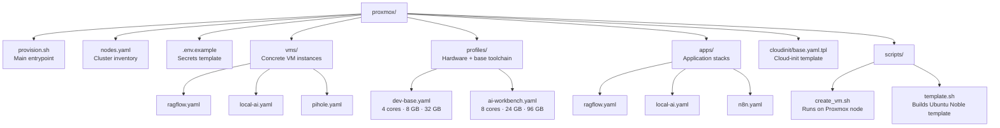
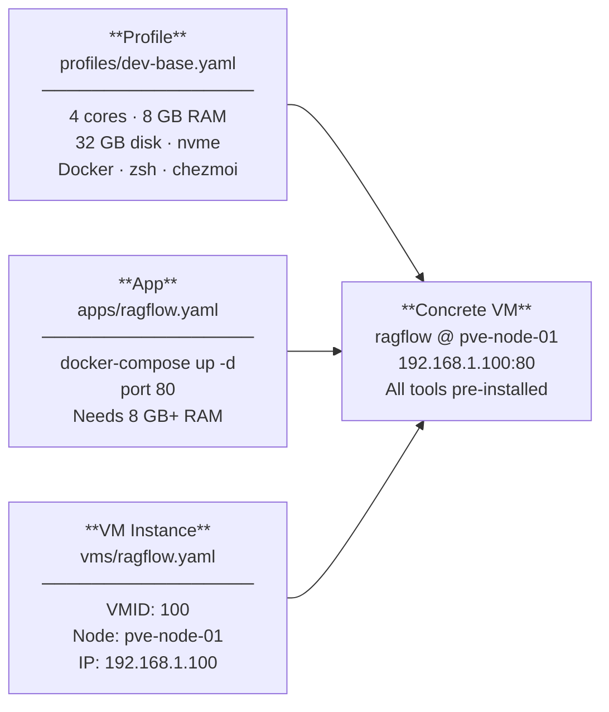
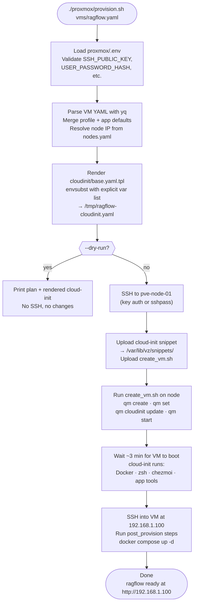

# Proxmox Provisioning

Homelab as code. Every VM that exists has a YAML file in `vms/`. Provision a
new VM with one command — or tell Claude and it'll handle the rest.

---

## Repo Structure



---

## VM Model — Three Layers

Every VM is composed from three YAML files that merge at provision time:



**Layer 1 — Profile** defines hardware and the base toolchain (Docker, zsh,
chezmoi, Oh My Zsh, Powerlevel10k). Reuse a profile across many VMs.

**Layer 2 — App** defines the application stack — what gets deployed after the
VM boots. Includes post-provision commands (e.g., `docker compose up -d`).

**Layer 3 — VM instance** specifies the concrete assignment: which node, VMID,
and IP. One YAML file per live VM in `vms/`.

---

## Provisioning Flow



---

## Bootstrap Flow

For a fresh Linux host with only root + password access. Run this **before**
the VM tools or manually for a bare-metal server / VPS.

```mermaid
sequenceDiagram
    participant local as Local Machine
    participant host as Linux Host<br/>(root access only)

    local->>host: SSH as root (sshpass from .env)
    host->>host: Create user 'mike'<br/>add to sudo + docker groups
    host->>host: Write /etc/sudoers.d/mike-nopasswd<br/>NOPASSWD: ALL
    local->>host: Upload SSH_PUBLIC_KEY from .env
    host->>host: Append to ~/.ssh/authorized_keys<br/>(deduped with sort -u)
    host->>host: Harden sshd:<br/>PubkeyAuthentication yes<br/>PasswordAuthentication no<br/>PermitRootLogin no
    host->>host: Restart sshd
    host-->>local: Host secured ✓<br/>Connect: ssh mike@&lt;host&gt;
```

```bash
# Run from your local machine
bash linux/00_bootstrap.sh 192.168.1.50
bash linux/00_bootstrap.sh 192.168.1.50 --root-pass 'mypassword'
```

---

## First-Time Setup

### 1. Copy and fill in secrets

```bash
cp proxmox/.env.example proxmox/.env
# Fill in: PROXMOX_PASS, SSH_PUBLIC_KEY, USER_PASSWORD_HASH, CHEZMOI_USER
```

Generate `USER_PASSWORD_HASH`:
```bash
mkpasswd -m sha-512          # Linux
docker run -it --rm alpine mkpasswd -m sha512  # anywhere
```

### 2. Build the Ubuntu Noble template (once per cluster)

SSH into `pve-node-01` and run:
```bash
bash proxmox/scripts/template.sh
```

This creates VM 8200 (`ubuntu-24-04-cloud`) on the `nvme` storage pool.
All subsequent VMs clone from this template — no re-downloading the image.

### 3. Provision a VM

```bash
# Preview what will happen (no changes made)
./proxmox/provision.sh --dry-run proxmox/vms/ragflow.yaml

# Provision for real
./proxmox/provision.sh proxmox/vms/ragflow.yaml
```

---

## Usage Examples

```bash
# Provision an existing VM definition
./proxmox/provision.sh proxmox/vms/ragflow.yaml
./proxmox/provision.sh proxmox/vms/local-ai.yaml

# Dry-run first to preview
./proxmox/provision.sh --dry-run proxmox/vms/ragflow.yaml
```

To add a new VM: create a file in `proxmox/vms/` referencing a profile and app,
then run `provision.sh` with it.

```yaml
# proxmox/vms/my-new-vm.yaml
profile: dev-base
app: n8n

vm:
  id: 102
  name: my-new-vm
  node: pve-node-02

network:
  ip: 192.168.1.115
  gateway: 192.168.1.1
  netmask: 24
  dns: 192.168.1.1
  searchdomain: home
```

---

## How Claude Operates This

Say: *"Spin up a dev VM with RagFlow on node 2"*

1. Read `proxmox/nodes.yaml` → resolve `pve-node-02` → `192.168.1.102`
2. Read `proxmox/profiles/dev-base.yaml` + `proxmox/apps/ragflow.yaml`
3. Scan `proxmox/vms/` + `nodes.yaml` ip_pool → find next free VMID and IP
4. Write `proxmox/vms/ragflow-v2.yaml` with the composed config
5. Run `./proxmox/provision.sh proxmox/vms/ragflow-v2.yaml`
6. Commit the new `vms/ragflow-v2.yaml` so the inventory stays current
7. Report: VM name, IP, how to connect

The repo is always the source of truth. Every VM that exists has a file in `vms/`.

---

## File Reference

| File | Purpose |
|------|---------|
| `provision.sh` | Main entrypoint — runs from any machine (Mac/Linux/MobaXterm) |
| `nodes.yaml` | Cluster inventory: node IPs, storage, IP pool, reserved IPs |
| `.env.example` | Secrets template — copy to `.env` and fill in |
| `.env` | *(gitignored)* Real secrets — never commit |
| `profiles/dev-base.yaml` | 4 cores / 8 GB / 32 GB — standard dev VM |
| `profiles/ai-workbench.yaml` | 8 cores / 24 GB / 96 GB — heavy AI workloads |
| `apps/ragflow.yaml` | RAG document Q&A — docker-compose, port 80 |
| `apps/local-ai.yaml` | LocalAI inference server — port 8080 |
| `apps/n8n.yaml` | n8n workflow automation — port 5678 |
| `vms/ragflow.yaml` | ragflow VM instance — VMID 100, 192.168.1.100 |
| `vms/local-ai.yaml` | local-ai VM instance — VMID 101, 192.168.1.110 |
| `vms/pihole.yaml` | pihole LXC — CTID 5001, 192.168.1.2 |
| `cloudinit/base.yaml.tpl` | Cloud-init template: Docker, zsh, chezmoi, Oh My Zsh |
| `scripts/create_vm.sh` | Runs on the Proxmox node — wraps `qm` CLI |
| `scripts/template.sh` | Builds Ubuntu Noble cloud template (VM 8200) |

---

## Secrets Reference

```bash
# proxmox/.env.example — committed to git
PROXMOX_USER=root
PROXMOX_PASS=                   # Proxmox root password
SSH_PUBLIC_KEY=                 # Your public key — paste inline
USER_PASSWORD_HASH=             # sha-512 hash: mkpasswd -m sha-512
CHEZMOI_USER=marsmike           # GitHub username for chezmoi dotfiles
GH_TOKEN=                       # GitHub token (for gh auth, chezmoi private repos)
DOTFILES_REPO=                  # dotfiles repo URL
SETUP_USER=mike                 # Username to create in VMs
```
